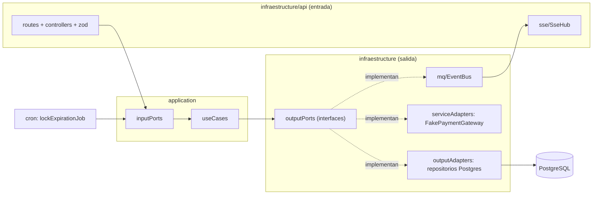
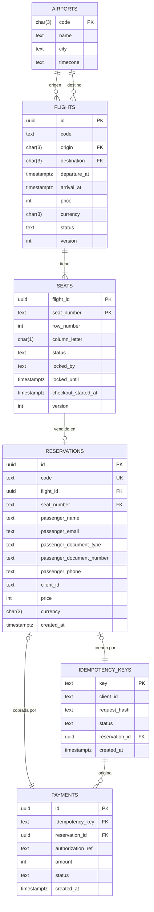
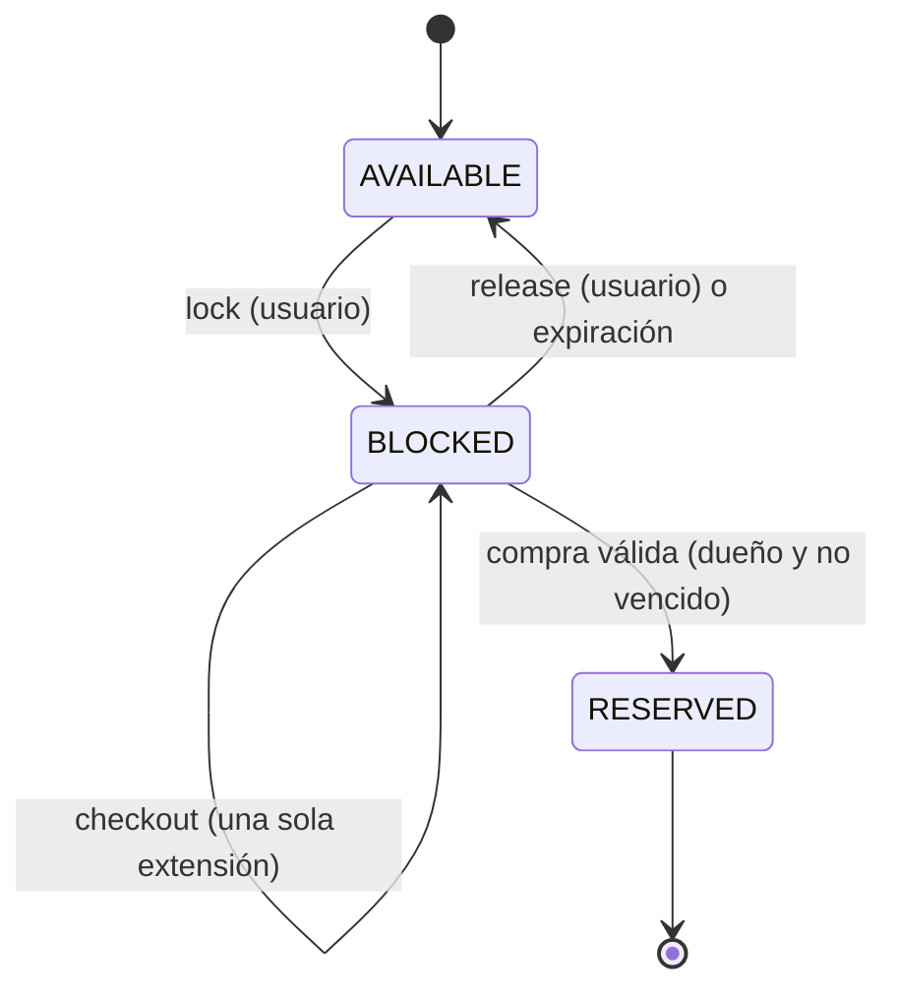
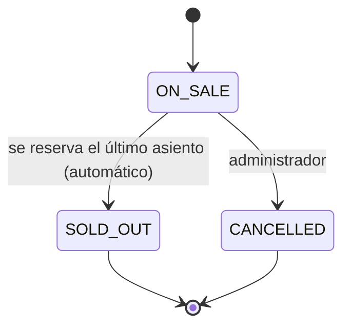
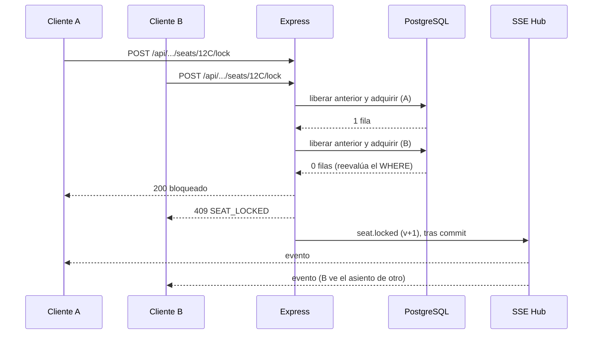
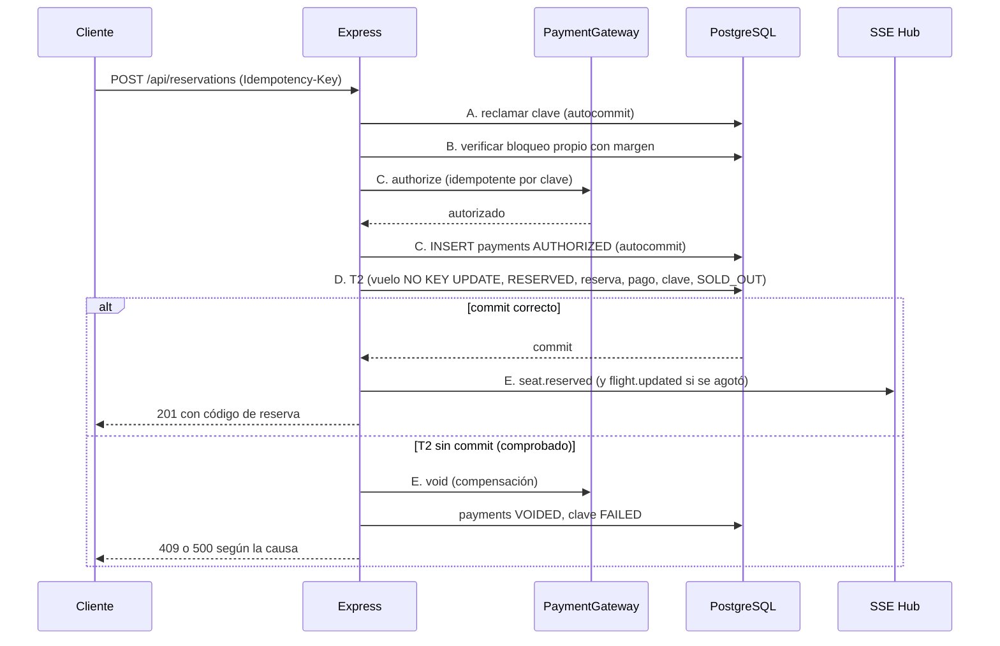
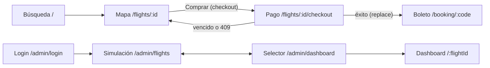

# Arquitectura: Sistema de Reservas de Vuelos en Tiempo Real

Este documento es la fuente de verdad del diseño. Cualquier asistente de IA que ayude a escribir código en este repositorio debe leerlo antes de generar o modificar nada, y seguir la sección 16 (Reglas para asistentes de IA).

## 1. Resumen

Prototipo donde varios usuarios buscan vuelos, ven el mapa de asientos, bloquean un asiento temporalmente y confirman la compra con un pago simulado. Un área administrativa muestra la ocupación en vivo y permite simular cambios de estado de los vuelos.

Garantías del sistema:

- **Nunca se vende dos veces el mismo asiento.**
- **Nunca se cobra dos veces la misma solicitud.**
- Todos los clientes conectados ven los cambios de estado al instante.

Decisión central: **la base de datos es la fuente de verdad y el árbitro de la concurrencia; SSE solo notifica**.

El sistema monitorea la **venta** de cada vuelo (asientos libres, bloqueados y vendidos), no su operación en vivo: los estados del vuelo son solo `ON_SALE`, `SOLD_OUT` y `CANCELLED`.

## 2. Stack

| Capa | Tecnología | Motivo |
| --- | --- | --- |
| Frontend | React 18 + Vite + TypeScript | Requisito de la prueba |
| Estado del frontend | Un store con `useReducer` y Context; TanStack Query solo para peticiones | Un único origen de verdad que aplica los eventos con control de versión |
| Backend | Node 20 LTS + Express + TypeScript, arquitectura hexagonal | Requisito de la prueba; el dominio queda aislado de la infraestructura |
| Validación | zod | Esquemas que además generan los tipos |
| Base de datos | PostgreSQL 16 | Atomicidad por fila, restricciones, reloj único, persistencia |
| Acceso a datos | TypeORM (entidades, transacciones, lecturas) más SQL explícito parametrizado en las sentencias críticas, solo dentro de los adaptadores de salida | Productividad y dominio del ORM sin ocultar las sentencias que deciden la concurrencia |
| Tiempo real | Server-Sent Events (SSE) | Flujo unidireccional; HTTP estándar; reconexión nativa |
| Tipos compartidos | Paquete `shared` (npm workspaces) | Contrato único de DTOs, eventos y enums |
| Logging | pino, con redacción de datos de pago | Logs estructurados sin datos sensibles |
| Pruebas | Vitest + Supertest; Playwright para E2E | Concurrencia contra Postgres real y demo con dos pestañas automatizada |
| Contenedores | Docker + docker-compose; nginx sirve el frontend y hace de proxy de la API | Un solo comando para levantar todo y un único origen |

## 3. Estructura del repositorio

```
/
├── backend/
│   ├── Dockerfile
│   ├── package.json
│   ├── tsconfig.json
│   ├── vitest.config.ts
│   ├── tests/
│   │   ├── unit/                        # casos de uso con repositorios falsos en memoria
│   │   └── integration/                 # adaptadores y concurrencia contra Postgres real
│   └── src/
│       ├── index.ts                     # punto de entrada: compone dependencias y arranca
│       ├── domain/
│       │   ├── entities/                # Flight, Seat, Reservation, Airport, Payment, IdempotencyKey
│       │   ├── enums/                   # reexporta los enums de shared (SeatStatus, FlightStatus…)
│       │   └── interfaces/              # formas de datos: AcquireResult, SeatDiagnosis…
│       ├── application/
│       │   ├── dtos/                    # comandos, consultas y resultados de cada caso de uso
│       │   ├── inputPorts/              # una interfaz por caso de uso
│       │   ├── useCases/                # su implementación
│       │   ├── mappers/                 # dominio → DTOs de shared
│       │   ├── helpers/                 # reglas puras: estado efectivo, código de reserva, hash
│       │   └── errorHandler/            # AppError y subclases tipadas
│       └── infraestructure/
│           ├── api/                     # routes, controllers, middlewares, schemas (zod), sse/
│           ├── config/                  # variables de entorno (zod) y container.ts
│           ├── cron/                    # lockExpirationJob
│           ├── database/
│           │   ├── dataSource.ts
│           │   ├── entities/            # entidades TypeORM (con decoradores)
│           │   ├── mappers/             # ORM ↔ dominio
│           │   └── sql/                 # init.sql, seed.sql, reconciliation.sql
│           ├── mq/                      # EventBus en memoria
│           ├── outputPorts/             # interfaces: repositorios, PaymentGateway, EventPublisher, UnitOfWork
│           ├── outputAdapters/          # repositorios Postgres (aquí vive el SQL crítico)
│           ├── serviceAdapters/         # FakePaymentGateway
│           └── utilities/               # logger, pgErrors, asyncHandler
├── frontend/
│   ├── Dockerfile
│   ├── nginx.conf
│   ├── package.json
│   └── src/
│       ├── api/                         # cliente REST tipado (base /api)
│       ├── realtime/                    # EventStreamProvider, reducer, selectors
│       ├── features/
│       │   ├── flights/                 # búsqueda
│       │   ├── seat-map/                # mapa interactivo
│       │   ├── checkout/                # pantalla de pago
│       │   ├── booking/                 # boleto
│       │   └── admin/                   # login, guard, dashboard, simulación
│       ├── components/                  # FlightCard, SeatButton, Countdown, MetricCard, LiveRegion…
│       └── lib/                         # format.ts (COP, zona horaria), clock.ts, clientId.ts, labels.ts (textos de estados)
├── shared/
│   ├── package.json
│   └── src/                             # events.ts, dto.ts, enums.ts, errors.ts
├── docs/
│   ├── ia.md                            # obligatorio: uso de IA
│   └── architecture.md                  # obligatorio: diseño y decisiones
├── docker-compose.yml
├── .env.example
├── .dockerignore
├── .gitignore
├── package.json                         # workspaces: backend, frontend, shared
├── tsconfig.base.json
└── README.md                            # ejecución, diagrama y enlace a docs/
```

La carpeta se llama `infraestructure` (con esa grafía); debe escribirse igual en todos los imports.

## 4. Arquitectura del backend (hexagonal)

**Monolito modular con puertos y adaptadores.** Un solo despliegue; el dominio y los casos de uso no conocen Express, TypeORM ni PostgreSQL.

**Por qué no microservicios:** el problema exige consistencia fuerte sobre un recurso pequeño (el asiento). Dividirlo introduciría consistencia eventual justo donde no se tolera.

### 4.1 Capas y dependencias

| Capa | Contenido | Puede importar |
| --- | --- | --- |
| `domain` | Entidades sin decoradores, enums, interfaces de datos | Solo tipos de `shared` |
| `application` | Casos de uso, puertos de entrada, DTOs, mappers, helpers, errores | `domain` y `infraestructure/outputPorts` (solo interfaces) |
| `infraestructure` | Adaptadores de entrada y salida, configuración | Todo lo anterior |



Las reglas de dependencia se hacen cumplir con `no-restricted-imports` de ESLint, sin dependencias nuevas:

```js
// overrides de eslint
{ files: ['src/domain/**'], rules: { 'no-restricted-imports': ['error', {
    patterns: ['**/application/**', '**/infraestructure/**', 'typeorm', 'express', 'pg'] }] } },
{ files: ['src/application/**'], rules: { 'no-restricted-imports': ['error', {
    patterns: ['**/infraestructure/**', '!**/infraestructure/outputPorts/**',
               'typeorm', 'express', 'pg'] }] } },
```

### 4.2 Qué va en cada lugar

| Carpeta | Contenido en este proyecto |
| --- | --- |
| `application/useCases` | Once casos de uso: `SearchFlights`, `ListAirports`, `GetSeatSnapshot`, `LockSeat`, `UnlockSeat`, `StartCheckout`, `CreateReservation`, `GetReservation`, `CancelFlight`, `GetLockStages` (admin) y `ExpireLocks` |
| `application/inputPorts` | La interfaz de cada caso de uso; los controllers y el cron dependen de ella, no de la clase concreta |
| `application/errorHandler` | `AppError` con `code`, y subclases (`SeatLockedError`, `LockExpiredOrNotOwnedError`, `PaymentDeclinedError`…). La aplicación no conoce códigos HTTP |
| `application/helpers` | Estado efectivo de un asiento (un bloqueo vencido cuenta como libre), generador del código de reserva, hash de la solicitud de idempotencia, `diagnoseSeat` (clasifica el motivo cuando un `UPDATE` no afecta filas) |
| `application/mappers` | Dominio → DTOs de `shared`; nunca exponen `lockedBy` |
| `infraestructure/api` | Express bajo `/api`, controllers, middleware de `X-Admin-Key`, middleware que traduce `AppError.code` a HTTP, esquemas zod y `sse/SseHub` |
| `infraestructure/mq` | `EventBus` en memoria; punto de evolución hacia `LISTEN/NOTIFY` o Redis sin tocar los casos de uso |
| `infraestructure/outputPorts` | `FlightRepository`, `SeatRepository`, `ReservationRepository`, `AirportRepository`, `IdempotencyRepository`, `PaymentRepository`, `PaymentGateway`, `EventPublisher`, `UnitOfWork` |
| `infraestructure/outputAdapters` | Implementaciones Postgres, con los `UPDATE` atómicos de las secciones 7.1 a 7.4 |
| `infraestructure/serviceAdapters` | `FakePaymentGateway` (`authorize` y `void`) |
| `infraestructure/cron` | Job de expiración cada segundo con `setInterval` y guarda contra solapamiento |
| `infraestructure/database` | `dataSource.ts`, entidades ORM, mappers ORM ↔ dominio y los `.sql` |
| `infraestructure/utilities` | Logger pino con redacción, lectura de `driverError.code`, `asyncHandler` |

### 4.3 Reglas de diseño

- **Entidades de dominio separadas de las de TypeORM.** El dominio no lleva decoradores; las entidades ORM viven en `infraestructure/database/entities` y unos mappers las convierten. Los controllers nunca devuelven entidades: devuelven DTOs de `shared`.
- **Transacciones sin filtrar TypeORM hacia arriba.** El puerto `UnitOfWork` expone `run(work)` y un `TransactionContext` opaco que los métodos de los repositorios reciben como primer parámetro. Solo los adaptadores saben que por dentro es un `EntityManager`.
  ```ts
  export interface TransactionContext { readonly __brand: 'TransactionContext' }
  export interface UnitOfWork {
    run<T>(work: (tx: TransactionContext) => Promise<T>): Promise<T>;
  }
  ```
- **Eventos después del commit.** Dentro de `uow.run` el caso de uso acumula los eventos en una lista local; al salir de la unidad de trabajo (ya confirmada), los publica con `EventPublisher`. Los datos derivados del evento (por ejemplo `availableSeats`) se consultan después del commit.
- **Enums con una sola fuente:** `shared/`. `domain/enums` los reexporta, de modo que backend y frontend no tienen dos definiciones que puedan desalinearse.
- **El SQL decide, el dominio solo deriva y explica.** Reglas como "vuelo reservable" existen en el `WHERE` de la sentencia; los métodos del dominio nunca deciden una carrera.
- **Inyección manual** en `config/container.ts`; `index.ts` solo invoca la composición y arranca el servidor.

### 4.4 Recorrido: bloquear un asiento

1. `POST /api/flights/:id/seats/:seat/lock` entra por `api/routes`; el controller valida `X-Client-Id` con zod.
2. El controller llama a `LockSeatInputPort`, implementado por `LockSeatUseCase`.
3. El caso de uso abre `unitOfWork.run(...)`; dentro, `SeatRepository` libera el anterior y adquiere el nuevo.
4. Tras el commit, el caso de uso publica `seat.released` y `seat.locked` con `EventPublisher`.
5. `mq/EventBus` los entrega a `api/sse/SseHub`, que los envía a los clientes conectados.
6. El mapper convierte el resultado en un DTO de `shared`, que el controller devuelve.

## 5. Modelo de datos

Seis tablas. No hay tabla de usuarios: no existe autenticación real; cada pestaña se identifica con un `clientId` (UUID en `sessionStorage`) enviado en `X-Client-Id`.



### 5.1 Esquema (`backend/src/infraestructure/database/sql/init.sql`)

`init.sql` es la fuente de verdad del esquema; las entidades de TypeORM lo reflejan y `synchronize` está en `false`.

```sql
CREATE TABLE airports (
  code     CHAR(3) PRIMARY KEY CHECK (code ~ '^[A-Z]{3}$'),
  name     TEXT NOT NULL,
  city     TEXT NOT NULL,
  timezone TEXT NOT NULL DEFAULT 'America/Bogota'
);

CREATE TABLE flights (
  id            UUID PRIMARY KEY DEFAULT gen_random_uuid(),
  code          TEXT NOT NULL,
  origin        CHAR(3) NOT NULL REFERENCES airports(code) ON DELETE RESTRICT,
  destination   CHAR(3) NOT NULL REFERENCES airports(code) ON DELETE RESTRICT,
  departure_at  TIMESTAMPTZ NOT NULL,
  arrival_at    TIMESTAMPTZ NOT NULL,
  price   INTEGER NOT NULL CHECK (price > 0),   -- pesos enteros (COP no usa decimales)
  currency      CHAR(3) NOT NULL DEFAULT 'COP',
  status        TEXT NOT NULL DEFAULT 'ON_SALE'
                CHECK (status IN ('ON_SALE','SOLD_OUT','CANCELLED')),
  version       INTEGER NOT NULL DEFAULT 0,
  created_at    TIMESTAMPTZ NOT NULL DEFAULT now(),
  CHECK (origin <> destination),
  CHECK (arrival_at > departure_at)
);
CREATE INDEX ix_flights_search ON flights (origin, destination, departure_at);

CREATE TABLE seats (
  flight_id           UUID NOT NULL REFERENCES flights(id) ON DELETE RESTRICT,
  seat_number         TEXT NOT NULL,
  row_number          INTEGER NOT NULL CHECK (row_number > 0),
  column_letter       CHAR(1) NOT NULL CHECK (column_letter ~ '^[A-Z]$'),
  status              TEXT NOT NULL DEFAULT 'AVAILABLE'
                      CHECK (status IN ('AVAILABLE','BLOCKED','RESERVED')),
  locked_by           TEXT,
  locked_until        TIMESTAMPTZ,
  checkout_started_at TIMESTAMPTZ,
  version             INTEGER NOT NULL DEFAULT 0,
  PRIMARY KEY (flight_id, seat_number),
  CHECK (seat_number = row_number::text || column_letter),
  CHECK (
    (status = 'BLOCKED' AND locked_by IS NOT NULL AND locked_until IS NOT NULL)
    OR (status <> 'BLOCKED' AND locked_by IS NULL AND locked_until IS NULL
        AND checkout_started_at IS NULL)
  )
);
CREATE INDEX ix_seats_expiry ON seats (locked_until) WHERE status = 'BLOCKED';
CREATE UNIQUE INDEX ux_seats_one_lock_per_client
  ON seats (flight_id, locked_by) WHERE status = 'BLOCKED';

CREATE TABLE reservations (
  id              UUID PRIMARY KEY DEFAULT gen_random_uuid(),
  code            TEXT NOT NULL UNIQUE CHECK (code ~ '^[A-HJ-NP-Z2-9]{6}$'),
  flight_id       UUID NOT NULL,
  seat_number     TEXT NOT NULL,
  passenger_name            TEXT NOT NULL,
  passenger_email           TEXT NOT NULL,
  passenger_document_type   TEXT NOT NULL CHECK (passenger_document_type IN ('CC','CE','PASSPORT')),
  passenger_document_number TEXT NOT NULL,
  passenger_phone           TEXT NOT NULL CHECK (passenger_phone ~ '^\+[1-9][0-9]{7,14}$'),
  client_id       TEXT NOT NULL,
  price     INTEGER NOT NULL CHECK (price > 0),
  currency        CHAR(3) NOT NULL,
  created_at      TIMESTAMPTZ NOT NULL DEFAULT now(),
  UNIQUE (flight_id, seat_number),
  FOREIGN KEY (flight_id, seat_number)
    REFERENCES seats (flight_id, seat_number) ON DELETE RESTRICT
);

CREATE TABLE idempotency_keys (
  key            TEXT PRIMARY KEY,
  client_id      TEXT NOT NULL,
  request_hash   TEXT NOT NULL,
  status         TEXT NOT NULL CHECK (status IN ('IN_PROGRESS','COMPLETED','FAILED')),
  reservation_id UUID REFERENCES reservations(id) ON DELETE RESTRICT,
  created_at     TIMESTAMPTZ NOT NULL DEFAULT now(),
  CHECK ((status = 'COMPLETED') = (reservation_id IS NOT NULL))
);
CREATE INDEX ix_idempotency_created ON idempotency_keys (created_at);

CREATE TABLE payments (
  id                UUID PRIMARY KEY DEFAULT gen_random_uuid(),
  idempotency_key   TEXT NOT NULL REFERENCES idempotency_keys(key) ON DELETE RESTRICT,
  reservation_id    UUID REFERENCES reservations(id) ON DELETE RESTRICT,
  authorization_ref TEXT,
  amount      INTEGER NOT NULL CHECK (amount > 0),
  status            TEXT NOT NULL
                    CHECK (status IN ('AUTHORIZED','DECLINED','VOIDED','VOID_FAILED')),
  created_at        TIMESTAMPTZ NOT NULL DEFAULT now()
);
CREATE INDEX ix_payments_key ON payments (idempotency_key);
CREATE INDEX ix_payments_reservation ON payments (reservation_id);
```

### 5.2 Quién hace cumplir cada garantía

| Garantía | Quién |
| --- | --- |
| Un asiento no se vende dos veces | Base de datos: `UNIQUE (flight_id, seat_number)` en `reservations` |
| Código de reserva único y bien formado (sin `0`, `O`, `1`, `I`) | Base de datos: `UNIQUE` y `CHECK` |
| Coherencia del bloqueo (dueño y vencimiento solo si está bloqueado) | Base de datos: `CHECK` |
| Un asiento bloqueado por cliente y vuelo | Base de datos: índice único parcial |
| Origen distinto de destino, llegada posterior a salida, precios positivos | Base de datos: `CHECK` |
| Ganar una carrera por un asiento | Sentencia `UPDATE` atómica en el adaptador |
| Un asiento `RESERVED` tiene reserva y viceversa | Caso de uso (misma transacción) y conciliación |
| `SOLD_OUT` cuando no queda ningún asiento sin reservar | Caso de uso, con `FOR NO KEY UPDATE` sobre el vuelo |

`available_seats` y los conteos no se almacenan: se calculan al consultar, tratando como libre un bloqueo vencido aunque el job aún no lo haya limpiado. Sí se guardan el estado `SOLD_OUT` y las `version`, siempre dentro de la transacción que los origina.

### 5.3 Conciliación (`reconciliation.sql`)

Las dos primeras consultas deben devolver cero filas después de cualquier prueba de concurrencia:

1. Asientos `RESERVED` sin reserva.
2. Reservas cuyo asiento no está `RESERVED`.
3. Vuelos `SOLD_OUT` con asientos sin reservar, o `ON_SALE` con todo reservado (los `CANCELLED` se excluyen).
4. Pagos `AUTHORIZED` sin reserva (cobros huérfanos) y pagos `VOID_FAILED`.
5. Claves `IN_PROGRESS` con más de 60 segundos.

### 5.4 Datos semilla (`seed.sql`)

Determinista y relativo a `now()`: la ocupación parece aleatoria pero es reproducible (`setseed` con un valor fijo), así que cada `db:reset` produce lo mismo. Seis aeropuertos colombianos (`BOG`, `MDE`, `CLO`, `CTG`, `BAQ`, `BGA`) y siete vuelos con 48 asientos cada uno (8 filas, columnas A a F):

| # | Ruta | Salida | Ocupación | Estado |
| --- | --- | --- | --- | --- |
| 1 | Bogotá → Medellín | Mañana, 06:30 | Parcial aleatoria | `ON_SALE` |
| 2 | Bogotá → Medellín | Mañana, 12:00 | Vacío | `ON_SALE` |
| 3 | Bogotá → Medellín | Mañana, 18:00 | Parcial aleatoria | `ON_SALE` |
| 4 | Medellín → Bogotá | Mañana, 09:00 | Vacío | `ON_SALE` |
| 5 | Bogotá → Cartagena | Pasado mañana, 08:00 | Casi lleno (2 asientos libres) | `ON_SALE` |
| 6 | Bogotá → Cali | Mañana, 15:00 | Lleno | `SOLD_OUT` |
| 7 | Bogotá → Barranquilla | Pasado mañana, 14:00 | Casi lleno (2 asientos libres) | `ON_SALE` |

Los vuelos 1 a 3 comparten ruta y día para que la búsqueda muestre una lista con ocupaciones distintas; los vuelos 5 y 7 permiten vender el último asiento en vivo y ver el paso a "Vendido". Ningún vuelo semilla está cancelado: se cancela en vivo desde el panel.

Cada asiento reservado del seed lleva datos ficticios de pasajero que cumplen las validaciones (documento y teléfono `+57…`), un código de reserva del alfabeto permitido, su fila en `payments` (`AUTHORIZED`, con `authorization_ref` `SEED-…`) y su fila en `idempotency_keys` (`COMPLETED`), para que la conciliación pase desde el primer arranque.

Como las fechas se calculan al ejecutarse, el seed corre con un volumen vacío. Para que un volumen de días anteriores no deje la demo en el pasado, al arrancar el backend `refreshDemoData` compara el primer vuelo semilla con el inicio de "mañana" (hora de Bogotá): si ya pasó, borra solo los vuelos semilla (`AV101` a `AV107`) con sus reservas, pagos y claves, y vuelve a sembrar. Los demás vuelos no se tocan, y si los vuelos semilla no existen no hace nada. `npm run db:reset` sigue restableciendo todo.

## 6. Máquinas de estado

### Asiento



`RESERVED` es terminal. Un bloqueo vencido se trata como libre aunque el job aún no lo haya limpiado.

### Vuelo



`SOLD_OUT` y `CANCELLED` son terminales. Solo un vuelo `ON_SALE` que aún no haya despegado permite bloquear, extender y comprar. **Cancelar** es un único `UPDATE flights SET status = 'CANCELLED', version = version + 1 WHERE id = $1 AND status = 'ON_SALE' RETURNING version`; si no afecta filas, el vuelo no existe (`404`) o ya está `SOLD_OUT` o `CANCELLED` (`409 INVALID_TRANSITION`). **No se cancelan vuelos vendidos.** Al cancelar, los bloqueos activos expiran solos, un pago en curso se anula (7.3) y las reservas ya hechas se conservan sin reembolso; el boleto muestra el estado del vuelo. El paso a `SOLD_OUT` lo hace la transacción de compra (7.3).

### Etapas del bloqueo y glosario

Un bloqueo activo (`status = 'BLOCKED'` y `locked_until > now()`) tiene dos **etapas**, derivadas de `checkout_started_at`. No son estados nuevos ni se almacenan aparte:

| Etapa (`LockStage`, definida en `shared/`) | Condición en la base de datos | Texto en la interfaz |
| --- | --- | --- |
| `SELECTING` | `checkout_started_at IS NULL` | Eligiendo |
| `CHECKOUT` | `checkout_started_at IS NOT NULL` | Pagando |

Un bloqueo está **vencido** cuando `locked_until <= now()` y **activo** cuando `locked_until > now()`. Esta definición es la única y se usa en todas las sentencias.

Glosario único, para que código, base de datos e interfaz no tengan sinónimos:

| Texto en la interfaz | Identificador en código | Definición precisa |
| --- | --- | --- |
| Libre | `AVAILABLE`; `counts.available` | `AVAILABLE`, o `BLOCKED` vencido (estado efectivo) |
| Bloqueado | `BLOCKED`; `counts.blocked` | `BLOCKED` activo |
| Ocupado | `RESERVED`; `counts.reserved` | Asiento vendido |
| Tu asiento | `BLOCKED` con `mine: true` | Bloqueo activo de esta pestaña |
| De otro usuario | `BLOCKED` con `mine: false` | Bloqueo activo de otra pestaña |
| En venta | `FlightStatus.ON_SALE` | Se pueden bloquear y comprar asientos |
| Vendido | `FlightStatus.SOLD_OUT` | Todos los asientos `RESERVED` |
| Cancelado | `FlightStatus.CANCELLED` | Cancelado por el administrador; ya no se vende |
| Sin asientos por ahora | `ON_SALE` con `availableSeats = 0` | Hay bloqueos activos que podrían liberarse |

Los identificadores de código y de base de datos van siempre en inglés y en mayúsculas. Los textos en español se resuelven en un único mapa del frontend (`lib/labels.ts`); ninguna pantalla los escribe a mano.

## 7. Concurrencia y consistencia

### 7.0 Reglas de implementación con TypeORM (solo en `outputAdapters` y `database`)

- Las sentencias que deciden una carrera (adquirir, liberar, extender, reservar, expirar) se escriben como **SQL parametrizado** con `manager.query`, nunca con `QueryBuilder`.
- Los métodos de los repositorios reciben el `TransactionContext` como primer parámetro; el adaptador lo convierte internamente al `EntityManager` de la transacción. Nunca se usa un repositorio global dentro de una transacción.
- `manager.query` de un `UPDATE ... RETURNING` devuelve `[filas, cantidad]`; un helper único lo desestructura y tiene su propia prueba.
- La columna `version` se incrementa **una sola vez**, a mano, en el SQL (no combinar con `@VersionColumn`).
- Cada `@Column` declara su tipo explícitamente (`type: 'text'`), porque Vitest no emite metadatos de decoradores.
- Los errores de Postgres se traducen en un solo lugar (`utilities/pgErrors`) leyendo `driverError.code` (`23505`, `40P01`).

### 7.1 Bloqueo de asiento

Todo en una transacción. El orden importa: **liberar el anterior y luego adquirir el nuevo**, porque el índice único parcial impide dos bloqueos del mismo cliente en un vuelo ni siquiera por un instante. Si adquirir falla, el rollback restaura el asiento anterior.

```sql
-- 1. Liberar el asiento anterior del cliente en ese vuelo
UPDATE seats
SET status = 'AVAILABLE', locked_by = NULL, locked_until = NULL,
    checkout_started_at = NULL, version = version + 1
WHERE flight_id = $1 AND locked_by = $3 AND status = 'BLOCKED' AND seat_number <> $2
RETURNING seat_number, version;

-- 2. Adquirir el nuevo (atómico; libre o vencido)
UPDATE seats s
SET status = 'BLOCKED', locked_by = $3,
    locked_until = now() + make_interval(secs => $4),
    checkout_started_at = NULL, version = version + 1
WHERE s.flight_id = $1 AND s.seat_number = $2
  AND (s.status = 'AVAILABLE' OR (s.status = 'BLOCKED' AND s.locked_until <= now()))
  AND EXISTS (SELECT 1 FROM flights f
              WHERE f.id = s.flight_id
                AND f.status = 'ON_SALE'
                AND f.departure_at > now())
RETURNING seat_number, version, locked_until;
```

- 1 fila devuelta → ganó; se confirma la transacción y, tras el commit, se emiten `seat.released` (si hubo anterior) y `seat.locked`.
- 0 filas → rollback (lo que restaura el asiento anterior) y **diagnóstico**, que solo explica el resultado y nunca decide nada.
- `23505` (dos bloqueos simultáneos del mismo cliente) → `409` con reintento; `40P01` (deadlock) → un único reintento.

#### Diagnóstico del asiento

Es una sola lectura, fuera de la transacción ya revertida, compartida por bloquear, extender y liberar (`SeatRepository.diagnose`). Recibe `$1` vuelo, `$2` asiento y `$3` clientId, y **nunca devuelve `locked_by`**: la comparación con el cliente se hace en SQL.

```sql
SELECT (s.seat_number IS NOT NULL)             AS seat_exists,
       s.status                                AS seat_status,
       s.locked_until                          AS locked_until,
       COALESCE(s.locked_by = $3, false)       AS locked_by_caller,
       COALESCE(s.locked_until > now(), false) AS lock_active,
       (s.checkout_started_at IS NOT NULL)     AS checkout_started,
       f.status                                AS flight_status,
       (f.departure_at > now())                AS flight_departs_later
FROM flights f
LEFT JOIN seats s ON s.flight_id = f.id AND s.seat_number = $2
WHERE f.id = $1;
```

Cero filas significa que el vuelo no existe. El repositorio devuelve un `SeatDiagnosis` (interfaz de dominio) y la función pura `application/helpers/diagnoseSeat` lo clasifica según la operación. Un vuelo es reservable si `flight_status` es `ON_SALE` y `flight_departs_later` es verdadero.

Clasificación para **bloquear**. Se evalúa en orden y gana la primera regla que aplique:

| # | Condición | Resultado |
| --- | --- | --- |
| 1 | Sin fila, o `seat_exists` falso | `404 SEAT_NOT_FOUND` |
| 2 | Vuelo no reservable (cancelado, vendido o ya despegado) | `409 FLIGHT_NOT_BOOKABLE` |
| 3 | `seat_status = 'RESERVED'` | `409 SEAT_RESERVED` |
| 4 | `BLOCKED`, `locked_by_caller` y `lock_active` | `200` idempotente con el `locked_until` original, sin evento |
| 5 | `BLOCKED`, no `locked_by_caller` y `lock_active` | `409 SEAT_LOCKED` con `lockedUntil` |
| 6 | Cualquier otro caso (libre o vencido: el estado cambió entre las dos sentencias) | Se repite la operación completa una vez; si vuelve a fallar sin explicación, `409 SEAT_LOCKED` sin `lockedUntil` |

La regla 2 va antes que la 3 porque el vuelo es la puerta más exterior (coincide con el `EXISTS` del `UPDATE`): en un vuelo vendido se informa que el vuelo está vendido, no que el asiento está ocupado.

**Liberar** (`DELETE .../lock`) es un `UPDATE ... WHERE flight_id = $1 AND seat_number = $2 AND status = 'BLOCKED' AND locked_by = $3` que devuelve el asiento a `AVAILABLE` (con `checkout_started_at = NULL` y `version + 1`) y, tras el commit, emite `seat.released` con `reason: 'RELEASED'`. Si no afecta filas:

| # | Condición | Resultado |
| --- | --- | --- |
| 1 | Sin fila, o `seat_exists` falso | `404 SEAT_NOT_FOUND` |
| 2 | `BLOCKED`, no `locked_by_caller` y `lock_active` | `403 LOCK_NOT_OWNED` |
| 3 | Cualquier otro caso (ya estaba libre, vencido o ya liberado) | `204` idempotente, sin evento |

**Por qué gana exactamente una solicitud:** en `READ COMMITTED`, el segundo `UPDATE` espera el candado de la fila y, cuando el primero confirma, **reevalúa el `WHERE`** sobre la fila ya modificada: falla y devuelve cero filas. No hacen falta locks propios ni `SERIALIZABLE`.

**Privacidad:** `locked_by` nunca sale del servidor. El snapshot devuelve `mine: true|false` calculado con `X-Client-Id`.

### 7.2 Extensión del bloqueo al comprar

El clic en "Comprar" llama a `POST /api/flights/:id/seats/:seat/checkout`, que reinicia el bloqueo a `CHECKOUT_TTL_SECONDS` (300) **más `PAYMENT_MARGIN_SECONDS` (10)**, es decir, a 5:10. Antes de cobrar, el servidor exige que al bloqueo le queden al menos `PAYMENT_MARGIN_SECONDS` (fase B de 7.3); por eso el usuario dispone de **5:00 útiles exactos**, y el servidor calcula `payableUntil = locked_until - margen`. **El cliente cuenta siempre hasta `payableUntil`, nunca hasta `lockedUntil`**, para que el contador llegue a cero justo cuando ya no se puede pagar.

**Se puede hacer una sola vez por bloqueo**, de modo que el máximo total es de 10 minutos y 10 segundos (hasta 5 de selección y 5:10 de pago); sin ese límite, alguien podría retener un asiento indefinidamente.

```sql
UPDATE seats s
SET locked_until = GREATEST(s.locked_until, now() + make_interval(secs => $4)),  -- $4 = CHECKOUT_TTL + margen
    checkout_started_at = now(),
    version = version + 1
WHERE s.flight_id = $1 AND s.seat_number = $2
  AND s.status = 'BLOCKED' AND s.locked_by = $3
  AND s.locked_until > now()
  AND s.checkout_started_at IS NULL
  AND EXISTS (SELECT 1 FROM flights f
              WHERE f.id = s.flight_id
                AND f.status = 'ON_SALE'
                AND f.departure_at > now())
RETURNING locked_until, version;
```

Respuesta: `200 { lockedUntil, payableUntil, version }`. Si el `UPDATE` no afecta filas se usa el mismo diagnóstico de 7.1, con esta clasificación (en orden, gana la primera que aplique):

| # | Condición | Resultado |
| --- | --- | --- |
| 1 | Sin fila, o `seat_exists` falso | `404 SEAT_NOT_FOUND` |
| 2 | Vuelo no reservable | `409 FLIGHT_NOT_BOOKABLE` |
| 3 | `BLOCKED`, `locked_by_caller`, `lock_active` y `checkout_started` | `200` idempotente con el `lockedUntil` y el `payableUntil` vigentes, sin extender ni emitir evento |
| 4 | Cualquier otro caso (libre, `RESERVED`, de otro cliente o vencido) | `409 LOCK_EXPIRED_OR_NOT_OWNED`, un único código para no revelar quién tiene el asiento |

Al extender se reutiliza `seat.locked` con el nuevo `lockedUntil`. **Toda transición que sale de `BLOCKED` pone `checkout_started_at` en `NULL`** (liberar, expirar, reservar y adquirir de nuevo).

### 7.3 Compra

La compra se ejecuta en cinco fases con **límites transaccionales explícitos**. Solo la fase D es una transacción de varias sentencias; el resto son sentencias individuales en autocommit o llamadas externas.

| Fase | Qué ocurre | Transacción |
| --- | --- | --- |
| A. Reclamar | `INSERT` de la clave de idempotencia en `IN_PROGRESS` | Autocommit (debe ser visible de inmediato para las solicitudes concurrentes) |
| B. Verificar | Lectura: bloqueo propio con `payableUntil > now()` y vuelo reservable; devuelve el precio | Sin transacción |
| C. Cobrar | `PaymentGateway.authorize` y, tras responder, `INSERT` en `payments` | Llamada externa y autocommit |
| D. Reservar | Transacción corta `T2` | Una sola transacción |
| E. Cerrar | Publicar eventos, o compensar y registrar el fallo | Autocommit |

**Fase A: reclamar.**

```sql
INSERT INTO idempotency_keys (key, client_id, request_hash, status)
VALUES ($1, $2, $3, 'IN_PROGRESS') ON CONFLICT (key) DO NOTHING RETURNING key;
```

Si la clave ya existía: `COMPLETED` con el mismo hash → se reconstruye y devuelve la reserva (`200`); hash distinto → `422 IDEMPOTENCY_KEY_MISMATCH`; `IN_PROGRESS` reciente → `409 REQUEST_IN_PROGRESS`; `FAILED`, o `IN_PROGRESS` con más de 60 s → se reclama de nuevo con un `UPDATE` condicional (ver recuperación).

**Fase B: verificar.** El asiento debe ser mío, estar `BLOCKED` con `locked_until > now() + PAYMENT_MARGIN_SECONDS` (es decir, `payableUntil > now()`), y el vuelo debe ser reservable; el mismo `SELECT` devuelve el precio. Si falla → clave `FAILED` y `409` (`LOCK_EXPIRED_OR_NOT_OWNED` o `FLIGHT_NOT_BOOKABLE`), sin haber cobrado.

**Fase C: cobrar y registrar la autorización.**

1. `authorize(idempotencyKey, amount, tarjeta)`. El contrato del puerto exige que sea **idempotente por clave**: repetirlo devuelve la misma autorización y nunca cobra dos veces. Nunca se llama a la pasarela dentro de una transacción.
2. Rechazo → `INSERT` en `payments` con estado `DECLINED`, clave `FAILED` y `402 PAYMENT_DECLINED`; el bloqueo se conserva.
3. Autorizado → `INSERT` en `payments` con estado `AUTHORIZED` (con `authorization_ref` y sin `reservation_id`), **en autocommit y antes de la fase D**. Así la autorización queda registrada de forma durable aunque `T2` falle o el proceso caiga; es lo que permite compensar y conciliar.

**Fase D: `T2`, la única transacción.** Es una sola transacción porque estas escrituras deben ocurrir juntas o no ocurrir; es corta porque no contiene ninguna llamada externa. El orden de las sentencias es fijo:

```sql
-- 1. Serializa las reservas de ESTE vuelo
SELECT id FROM flights
WHERE id = $1 AND status = 'ON_SALE' AND departure_at > now()
FOR NO KEY UPDATE;                                       -- 0 filas: FLIGHT_NOT_BOOKABLE

-- 2. Reservar el asiento
UPDATE seats SET status = 'RESERVED', locked_by = NULL, locked_until = NULL,
                 checkout_started_at = NULL, version = version + 1
WHERE flight_id = $1 AND seat_number = $2
  AND status = 'BLOCKED' AND locked_by = $3 AND locked_until > now()
RETURNING version;                                       -- 0 filas: LOCK_EXPIRED_OR_NOT_OWNED

-- 3. INSERT en reservations (código con reintento ante colisión, hasta 5 veces)

-- 4. Vincular el pago (debe afectar exactamente 1 fila)
UPDATE payments SET reservation_id = $r
WHERE idempotency_key = $k AND status = 'AUTHORIZED' AND reservation_id IS NULL;

-- 5. Completar la clave (debe afectar exactamente 1 fila)
UPDATE idempotency_keys SET status = 'COMPLETED', reservation_id = $r WHERE key = $k;

-- 6. Marcar SOLD_OUT si era la última plaza
UPDATE flights SET status = 'SOLD_OUT', version = version + 1
WHERE id = $1 AND status = 'ON_SALE'
  AND NOT EXISTS (SELECT 1 FROM seats WHERE flight_id = $1 AND status <> 'RESERVED')
RETURNING version;                                       -- 0 filas: normal, no era la última
```

**Contención.** `T2` toma un candado de fila sobre el vuelo y filas propias de esta solicitud (el asiento, la reserva nueva, su pago y su clave). Solo bloquea, durante milisegundos, a otra reserva **del mismo vuelo** y a un cambio administrativo de estado de ese vuelo. No bloquea bloquear, extender ni expirar asientos (no modifican `flights`), ni las lecturas (MVCC), ni las reservas de otros vuelos. Se usa `FOR NO KEY UPDATE` y no `FOR UPDATE` porque no se modifica la clave del vuelo: el candado más débil no bloquea a quien solo referencia esa fila por clave foránea. El orden de las sentencias es siempre el mismo (vuelo, asiento, reserva, pago, clave), lo que descarta ciclos de espera.

**Por qué el candado es necesario.** Sin él, dos reservas simultáneas de las dos últimas plazas no verían la compra de la otra en `READ COMMITTED` y ninguna marcaría el vuelo como `SOLD_OUT`. Marcar `SOLD_OUT` después del commit evitaría el candado, pero dejaría una ventana en la que una caída deja el vuelo lleno sin estar vendido; se descartó por eso.

Ante `40P01` (deadlock) o un fallo de serialización, `T2` se reintenta una vez; la autorización se conserva.

**Fase E: cerrar.**

- **Commit correcto:** se publican `seat.reserved` y, si el vuelo se agotó, `flight.updated`; respuesta `201`. Un fallo al publicar eventos **no** compensa (la reserva ya existe): se registra y los clientes se resincronizan con el snapshot.
- **`T2` sin commit:** compensación (siguiente apartado).

#### Compensación

**Regla:** se compensa si y solo si existe una autorización registrada (`payments` en `AUTHORIZED`) y se ha comprobado que la reserva **no** se confirmó. Compensar es: `PaymentGateway.void(authorization_ref)`, luego `UPDATE payments` a `VOIDED` (o a `VOID_FAILED`, con alerta y registro de la referencia para la conciliación) y la clave a `FAILED`. Los fallos, uno por uno:

| Punto de fallo | Respuesta | ¿Compensa? |
| --- | --- | --- |
| Fase B: bloqueo vencido, ajeno o vuelo no reservable | `409 LOCK_EXPIRED_OR_NOT_OWNED` o `FLIGHT_NOT_BOOKABLE` | No (aún no hay autorización) |
| Fase C: rechazo de la pasarela | `402 PAYMENT_DECLINED` | No (no hay autorización) |
| Fase C: error o tiempo agotado de la pasarela | Se reintenta `authorize` una vez (es idempotente); si sigue sin respuesta, `503 PAYMENT_UNAVAILABLE` y clave `FAILED` | No hay autorización conocida (límite de la simulación: una pasarela real se concilia con su propio reporte) |
| `T2` sentencia 1: vuelo no reservable (cancelado o despegado mientras se pagaba) | `409 FLIGHT_NOT_BOOKABLE` | Sí |
| `T2` sentencia 2: bloqueo vencido o ajeno | `409 LOCK_EXPIRED_OR_NOT_OWNED` | Sí |
| `T2` sentencia 3: colisión del código de reserva | Se reintenta dentro de `T2` hasta 5 veces; no es un fallo | — |
| `T2` sentencia 3: violación de `UNIQUE (flight_id, seat_number)` o de la llave foránea | Imposible tras la sentencia 2; si ocurre, `500 INTERNAL_ERROR` | Sí |
| `T2` sentencias 4 o 5: no afectan exactamente una fila | Invariante rota: rollback y `500 INTERNAL_ERROR` | Sí |
| `T2` sentencia 6: no afecta filas | Normal: no era la última plaza | — |
| `T2`: deadlock o fallo de serialización | Se reintenta `T2` una vez; si se repite, `500 INTERNAL_ERROR` | Sí |
| `T2`: se pierde la conexión al confirmar (resultado incierto) | **No se anula a ciegas:** se consulta `idempotency_keys` por la clave; `COMPLETED` significa que la reserva existe (se responde como éxito); si no, se compensa | Solo si se comprueba que no hubo commit |
| Caída del proceso tras registrar la autorización | Ver recuperación | Según el caso |
| Falla el `void` | La respuesta conserva la causa original; `payments` queda en `VOID_FAILED` con alerta | — |

**Recuperación tras una caída.** Una clave `IN_PROGRESS` con más de 60 s se reclama de nuevo. Si `payments` ya tiene una autorización `AUTHORIZED` sin reserva para esa clave, no se vuelve a autorizar: se repite la verificación de la fase B y, si pasa, se continúa en la fase D; si no pasa, se anula (compensación).

**Datos de pago:** nunca se persisten ni se registran (pino los redacta). El monto lo toma siempre el servidor del vuelo. La pasarela es el puerto `PaymentGateway` (`authorize`, `void`); su adaptador simulado rechaza tarjetas terminadas en `0000`, es idempotente por clave (guarda la autorización por clave en memoria, que se pierde al reiniciar: límite de la simulación) y admite latencia configurable para poder mostrar la carrera entre pago y vencimiento.

### 7.4 Expiración: doble mecanismo

1. **Corrección:** la condición `locked_until <= now()` al adquirir trata un bloqueo vencido como libre de inmediato; no depende de ningún proceso.
2. **Notificación:** el job de `cron/`, cada `EXPIRATION_JOB_INTERVAL_MS` (1000) y sin solaparse consigo mismo, invoca `ExpireLocksInputPort`, que ejecuta:
   ```sql
   UPDATE seats
   SET status = 'AVAILABLE', locked_by = NULL, locked_until = NULL,
       checkout_started_at = NULL, version = version + 1
   WHERE status = 'BLOCKED' AND locked_until <= now()
   RETURNING flight_id, seat_number, version;
   ```
   y emite `seat.released` con `reason: 'EXPIRED'` por cada fila. Si el job y una adquisición compiten por la misma fila, el candado las serializa y la segunda reevalúa su `WHERE`.

### 7.5 Reloj

Todo tiempo se calcula con `now()` de PostgreSQL, nunca con la hora del proceso Node. El cliente calcula su desfase con `serverTime` del snapshot para que las cuentas regresivas no dependan de su reloj.

## 8. Tiempo real con SSE

### 8.1 Por qué SSE

El flujo es unidireccional: los comandos van por REST (permiten códigos HTTP como `409`, idempotencia y validación) y el servidor solo notifica. SSE usa HTTP estándar, reconecta solo y es más simple de operar y asegurar que un protocolo propio.

### 8.2 Contrato de eventos (`shared/src/events.ts`)

```ts
export type FlightStatus = 'ON_SALE' | 'SOLD_OUT' | 'CANCELLED';

export type FlightEvent =
  | { type: 'seat.locked';    flightId: string; seat: string; version: number; lockedUntil: string }
  | { type: 'seat.released';  flightId: string; seat: string; version: number;
      reason: 'EXPIRED' | 'RELEASED' }
  | { type: 'seat.reserved';  flightId: string; seat: string; version: number }
  | { type: 'flight.updated'; flightId: string; status: FlightStatus;
      availableSeats: number; version: number };
```

Un único stream por pestaña (`GET /api/events`) alimenta lista, mapa, dashboard y boleto. Se envía **todo** sin filtrar por vuelo; el cliente filtra el que está viendo. El campo `event:` lleva el `type` y `data:` el JSON. Los eventos nunca contienen quién tiene un bloqueo ni datos del pasajero.

`flight.updated` se emite cuando el vuelo se cancela o se vende por completo. La lista de búsqueda **no** se actualiza con cada bloqueo, solo con ese evento o al reconectar.

### 8.3 Snapshot y reconexión

`GET /api/flights/:id/seats` devuelve `{ flight, serverTime, counts: { available, blocked, reserved, total }, seats: [...] }`. No exige `X-Client-Id`: sin él, `mine` es siempre `false`. Para un asiento propio en etapa de pago incluye además `payableUntil`. Un bloqueo vencido cuenta como libre.

- **La verdad está en PostgreSQL; el evento es una notificación.** Al conectar o reconectar, el cliente vuelve a pedir el snapshot de los vuelos que está viendo, y también cuando la pestaña vuelve a estar visible.
- Cada evento de asiento trae `version`; el cliente descarta los de versión menor o igual a la que ya tiene.

### 8.4 Latido y vigilancia

Los comentarios SSE (`: ping`) no llegan a JavaScript, así que el latido es un **evento con nombre**: `event: heartbeat` cada `HEARTBEAT_INTERVAL_MS` (25 000). Si el cliente pasa más de 60 segundos sin ningún mensaje, cierra y reabre la conexión.

### 8.5 Detalles operativos

- Cabeceras de `/api/events`: `Content-Type: text/event-stream`, `Cache-Control: no-cache`, `Connection: keep-alive`, `X-Accel-Buffering: no`, y `flushHeaders()` inmediato.
- Ningún middleware de compresión en esa ruta; en nginx, `proxy_buffering off` (sección 12.3).
- Al cerrarse la conexión (`req.on('close')`), el cliente se elimina del `SseHub`.
- Un solo `EventSource` por pestaña, para no chocar con el límite de HTTP/1.1.

### 8.6 Secuencia: dos usuarios compiten por el mismo asiento



### 8.7 Secuencia: compra



## 9. API

Toda la API vive bajo el prefijo `/api`. Formato de error: `{ "error": { "code": "…", "message": "…" } }`. Todo lo que empieza con `/api/admin` exige la cabecera `X-Admin-Key` mediante un único middleware. Las pantallas del frontend (`/admin/...`) no colisionan con la API porque esta siempre lleva `/api`.

### 9.1 Pública

| Método y ruta | Propósito | Errores |
| --- | --- | --- |
| `GET /api/health` | Comprueba la conexión a la base (healthcheck de Docker) | 503 |
| `GET /api/airports` | Aeropuertos para listas y validación | — |
| `GET /api/flights?origin&destination&date` | Búsqueda; devuelve también los vuelos no reservables, con su estado | 400 |
| `GET /api/flights/:id/seats` | Snapshot del mapa con conteos, `serverTime` y `payableUntil` de mi asiento en pago | 404 |
| `POST /api/flights/:id/seats/:seat/lock` | Bloquear (`X-Client-Id` obligatoria) | 409 `SEAT_LOCKED`, `SEAT_RESERVED`, `FLIGHT_NOT_BOOKABLE`; 404; 400 |
| `DELETE /api/flights/:id/seats/:seat/lock` | Liberar el propio bloqueo (idempotente: `204` si ya estaba libre) | 403 `LOCK_NOT_OWNED`; 404 |
| `POST /api/flights/:id/seats/:seat/checkout` | Reiniciar el bloqueo una sola vez; responde `{ lockedUntil, payableUntil, version }` | 409 `LOCK_EXPIRED_OR_NOT_OWNED`, `FLIGHT_NOT_BOOKABLE`; 404; 400 |
| `POST /api/reservations` | Compra (`X-Client-Id`, `Idempotency-Key`). Cuerpo: `flightId`, `seat`, `passenger` (`fullName`, `email`, `documentType`, `documentNumber`, `phone`) y `payment` (`holderName`, `cardNumber`, `expiry`, `cvv`) | 402 `PAYMENT_DECLINED`; 409 `LOCK_EXPIRED_OR_NOT_OWNED`, `FLIGHT_NOT_BOOKABLE`, `REQUEST_IN_PROGRESS`; 422 `IDEMPOTENCY_KEY_MISMATCH`; 503 `PAYMENT_UNAVAILABLE`; 500 `INTERNAL_ERROR`; 400; 404 |
| `GET /api/reservations/:code` | Boleto: `{ code, flight (con su estado), seat, passengerName, price, currency, createdAt }`. **Nunca** devuelve documento, teléfono ni correo | 404 |
| `GET /api/events` | Stream SSE | — |

La respuesta `201` de `POST /api/reservations` tiene la misma forma que el boleto.

### 9.2 Administrativa (`X-Admin-Key`)

| Método y ruta | Propósito | Errores |
| --- | --- | --- |
| `POST /api/admin/flights/:id/cancel` | Cancelar un vuelo `ON_SALE` | 401; 404; 409 `INVALID_TRANSITION` (ya vendido o cancelado) |
| `GET /api/admin/flights/:id/lock-stages` | Conteo de bloqueos activos por etapa (`SELECTING`, `CHECKOUT`) | 401; 404 |

`GET /api/admin/flights/:id/lock-stages` responde `{ flightId, selecting, checkout }` con:

```sql
SELECT COUNT(*) FILTER (WHERE checkout_started_at IS NULL)     AS selecting,
       COUNT(*) FILTER (WHERE checkout_started_at IS NOT NULL) AS checkout
FROM seats
WHERE flight_id = $1 AND status = 'BLOCKED' AND locked_until > now();
```

Cualquier error no previsto responde `500 INTERNAL_ERROR` con el formato estándar, sin detalles internos.

### 9.3 Validaciones

- **Búsqueda:** los tres filtros obligatorios. `origin` y `destination` de 3 letras (se normalizan a mayúsculas) y distintos entre sí; `date` en formato `YYYY-MM-DD`, no anterior a hoy en la zona horaria del aeropuerto de origen.
- **Pasajero:** `fullName` de 2 a 80 caracteres; `email` con formato válido; `documentType` en `CC`, `CE` o `PASSPORT` (enum `DocumentType` de `shared/`); `documentNumber`: `CC` solo dígitos (6 a 10), `CE` y `PASSPORT` alfanumérico (5 a 15); `phone` en formato internacional E.164.
- **Normalización en el servidor, antes de validar:** se recortan los nombres, el correo va en minúsculas, el número de documento en mayúsculas, y del teléfono se eliminan espacios, guiones y paréntesis. El teléfono normalizado debe cumplir `^\+[1-9][0-9]{7,14}$` (de 8 a 15 dígitos, empezando por `+`).
- **Tarjeta:** titular; número de 16 dígitos (se ignoran los espacios); vencimiento `MM/YY` no vencido; CVV de 3 o 4 dígitos.
- **Cabeceras:** `X-Client-Id` debe ser un UUID.
- **Idempotencia:** el `request_hash` se calcula sobre los valores **ya normalizados** de vuelo, asiento y pasajero, y **excluye los datos de tarjeta**, para no guardar derivados del número.

### 9.4 Búsqueda

La fecha se interpreta en la zona horaria del aeropuerto de origen y se convierte a un rango UTC:

```sql
SELECT f.id, f.code, f.origin, f.destination, f.departure_at, f.arrival_at,
       f.price, f.currency, f.status, f.version,
       COUNT(*) FILTER (WHERE s.status = 'AVAILABLE'
                           OR (s.status = 'BLOCKED' AND s.locked_until <= now())) AS available_seats
FROM flights f
JOIN airports ao ON ao.code = f.origin
JOIN seats s ON s.flight_id = f.id
WHERE f.origin = $1 AND f.destination = $2
  AND f.departure_at >= ($3::date)::timestamp AT TIME ZONE ao.timezone
  AND f.departure_at <  (($3::date + 1))::timestamp AT TIME ZONE ao.timezone
  AND f.departure_at > now()
GROUP BY f.id
ORDER BY f.departure_at;
```

`SOLD_OUT` ("Vendido") significa que todo está reservado; `availableSeats = 0` con estado `ON_SALE` significa que hay bloqueos pendientes ("Sin asientos por ahora").

## 10. Frontend

### 10.1 Pantallas y rutas

| Pantalla | Ruta | HU | Reacciona en vivo a |
| --- | --- | --- | --- |
| Búsqueda de vuelos | `/` | 1 | `flight.updated` |
| Mapa de asientos | `/flights/:id` | 2 | eventos de asiento y de vuelo |
| Pago | `/flights/:id/checkout` | 3 | vencimiento del bloqueo, vuelo cancelado |
| Boleto | `/booking/:code` | 3 | — |
| Acceso administrativo | `/admin/login` | 4 | — |
| Selector de dashboard | `/admin/dashboard` | 4 | `flight.updated` |
| Dashboard de ocupación | `/admin/dashboard/:flightId` | 4 | todos los eventos del vuelo |
| Simulación de vuelos (cancelar) | `/admin/flights` | 1 | resultado de la cancelación |
| No encontrado y error | `*` | — | — |



El cliente REST usa una URL base relativa (`VITE_API_URL=/api`), de modo que el navegador habla con un único origen y no hay CORS.

### 10.2 Acceso administrativo

- Todo lo administrativo está bajo `/admin`, sin ningún enlace desde la interfaz pública. El área tiene su propio encabezado (Dashboard, Simulación, Salir) y `noindex`.
- `/admin/login`: usuario y contraseña, ambos `admin`, comparados en el cliente. **Las credenciales no se muestran en pantalla**: se documentan solo en el README y en la sustentación. Sesión como indicador en `sessionStorage` (se pierde al cerrar la pestaña). Mensaje único "Usuario o contraseña incorrectos", anunciado con `aria-live`, sin indicar cuál campo falló.
- Tras iniciar sesión se vuelve a la ruta que se intentó abrir; si se entró directo al login, se llega a `/admin/flights`.
- Un componente `RequireAdmin` envuelve todas las rutas de `/admin` salvo el login.
- Dos pantallas administrativas comparten el componente de búsqueda de vuelos (`FlightSearch`): `/admin/dashboard` (cada resultado con "Ver dashboard") y `/admin/flights` (cada resultado con "Cancelar vuelo", solo si está `ON_SALE` y con confirmación). Sin resultados, `/admin/flights` muestra "Busca un vuelo para administrarlo".
- Las peticiones administrativas envían `X-Admin-Key` tomada de `VITE_ADMIN_KEY` (en Docker se inyecta como argumento de build desde `ADMIN_KEY`).
- **Límite consciente:** el login del cliente **oculta la vista, no protege nada**: las credenciales y la clave viajan en el código descargable, y los datos del dashboard ya llegan a todos por el snapshot y el stream. En producción sería autenticación real con roles, con la autorización validada en el servidor. El middleware `/api/admin/*` es solo una barrera mínima donde sí importa: las acciones que modifican datos.

### 10.3 Estado compartido

Un único store con `useReducer` y Context. TanStack Query se usa solo para peticiones (carga, errores, mutaciones); sus resultados se envían al reducer. Esto evita tener dos fuentes de verdad y permite probar el orden por versión con pruebas unitarias.

| Sección | Contenido |
| --- | --- |
| `connection` | `connecting`, `live` o `reconnecting`; hora del último mensaje |
| `clockOffsetMs` | `serverTime` menos la hora local |
| `flights` | Resúmenes por id, con su `version` |
| `seats` | Por vuelo y asiento: estado, `version` y `lockedUntil` |
| `myLock` | Por vuelo: el asiento bloqueado por esta pestaña, su `lockedUntil` y, en etapa de pago, su `payableUntil` |
| `activity` | Últimos 10 eventos por vuelo, solo en memoria |

Reglas del reducer:

- Un evento o snapshot reemplaza un asiento solo si su `version` es mayor que la almacenada.
- Un `seat.locked` que coincide con `myLock` se ignora; los demás se muestran como "de otro usuario".
- Un `seat.released` de mi asiento limpia `myLock` y muestra "Tu bloqueo venció" si el motivo fue `EXPIRED`.
- Un asiento `BLOCKED` con `lockedUntil` igual o anterior a la hora del servidor se trata como libre en los selectores.

Ciclo de vida del stream: un único `EventSource` al montar la aplicación; resincronización al abrir, al reconectar y en `visibilitychange`; vigilancia de 60 segundos sin mensajes; los eventos de un mismo fotograma se aplican juntos en un solo render. Los selectores son puros (conteos, porcentaje de ocupación, vista de un asiento).

### 10.4 Pantalla de pago

Una sola pantalla: el formulario a un lado y un resumen fijo al otro. En móvil, el resumen va arriba y la cuenta regresiva queda siempre visible.

- **Entrada protegida:** al montar, consulta el snapshot con `X-Client-Id` y exige un asiento propio bloqueado; si no lo hay, redirige al mapa con un aviso. Por eso sobrevive a recargas.
- **Origen:** el botón "Comprar" del mapa llama a `/checkout` y, si responde `200`, navega a esta pantalla.
- **Pasajero:** nombre completo, correo, documento (tipo `CC`, `CE` o `PASSPORT` más número) y teléfono internacional (valor inicial `+57`; acepta espacios y guiones al escribir). Validaciones de 9.3.
- **Tarjeta simulada:** titular, número (en grupos de 4), vencimiento MM/AA y CVV oculto, con los atributos `autocomplete` estándar.
- **Validación:** al salir de cada campo y al enviar; si hay errores, el foco pasa al primer campo inválido.
- **Resumen:** vuelo, asiento, precio en COP y cuenta regresiva. Texto visible: "Tienes 5 minutos para completar el pago".
- **Cuenta regresiva:** cuenta hasta `payableUntil` (5:00 útiles). A los 60 s se destaca (negrita, ícono y fondo suave, no solo color) y aparece "Te queda 1 minuto", anunciado una sola vez por lector de pantalla. **Al llegar a cero**, el cliente libera el asiento con `DELETE` (si falla, el bloqueo vence solo en pocos segundos) y **redirige automáticamente al mapa**, donde aparece "Tu tiempo para pagar venció. El asiento volvió a estar libre."; lo escrito se descarta. Si hay un pago en curso, no se redirige hasta recibir la respuesta.
- **Idempotencia:** la clave se genera al abrir la pantalla y se reutiliza ante fallos de red; tras un `402` se genera una nueva.
- **Envío:** el botón se bloquea mientras se procesa.
- **Rechazo (`402`):** solo el aviso "El pago fue rechazado". No hay pistas en pantalla sobre cómo simular un rechazo (la tarjeta terminada en `0000` se documenta en el README y en la sustentación). El formulario conserva lo escrito, el bloqueo se conserva y la cuenta regresiva sigue.
- **Volver al mapa:** conserva el bloqueo (no llama a la API). En el mapa, el asiento sigue como "Tu asiento" con la cuenta regresiva hasta `payableUntil`, y el botón pasa a "Continuar al pago", que vuelve a llamar a `/checkout` (idempotente: no extiende el tiempo).
- **Datos personales y de tarjeta:** viven solo en el estado local del formulario; nunca en almacenamiento.
- **Éxito:** navegación con `replace` a `/booking/:code`.
- **`409`:** aviso y regreso al mapa. **Vuelo cancelado durante el pago:** aviso y envío bloqueado. No se maneja ningún otro cambio del vuelo durante el pago.

### 10.5 Boleto

Solo en pantalla, para el pasajero. Muestra el código de reserva, el vuelo (ruta, salida y llegada), el asiento, el **nombre completo** y el precio. **Nunca** muestra documento, teléfono ni correo, y ningún endpoint de lectura los devuelve (lo hace cumplir el mapper de la respuesta y una prueba).

- Botones "Copiar código" y "Copiar enlace": como no hay consulta por código ni cuentas, el enlace es la única forma de volver a ver el boleto.
- Muestra el estado del vuelo. Si está `CANCELLED`, un aviso destacado ("Este vuelo fue cancelado", con ícono y texto), que aparece también en vivo si el vuelo se cancela mientras el boleto está abierto (usa el mismo store y stream).
- Se consulta por código, por lo que sobrevive a recargas. Imprimir o descargar queda fuera de alcance.

### 10.6 Dashboard

Es una vista derivada del mismo store que usa el mapa; **no tiene datos propios**.

- Tres tarjetas (Libres, Bloqueados y Ocupados, que corresponden a `counts.available`, `counts.blocked` y `counts.reserved`) con el total, el porcentaje de ocupación como cifra principal, y una barra apilada.
- Mapa en solo lectura como mapa de calor, y feed de actividad (últimos 10 eventos, se pierde al recargar).
- Estado del vuelo e indicador de conexión.
- Tarjeta administrativa "Etapa de los bloqueos" con los conteos `selecting` ("Eligiendo") y `checkout` ("Pagando"), alimentada por `GET /api/admin/flights/:id/lock-stages`, que se vuelve a consultar (con espera de 1 s) cuando llega un evento de asiento de ese vuelo.
- Resaltado breve (unos 600 ms) del elemento que cambió, desactivado con `prefers-reduced-motion`.
- Una región `aria-live="polite"` anuncia el resumen de conteos, como máximo una vez por segundo.
- Sin conexión: banner "Datos desactualizados desde las HH:MM" en lugar de cifras que parecen vivas.

### 10.7 Estados de interfaz obligatorios

| Pantalla | Estados |
| --- | --- |
| Búsqueda | Cargando, sin resultados, error de validación, vuelo no reservable (sin botón y con motivo), `SOLD_OUT` frente a "Sin asientos por ahora" |
| Mapa | Cargando, asiento tomado por otro, bloqueo propio vencido, vuelo cancelado o despegado (solo lectura), conexión perdida |
| Pago | Enviando, pago rechazado (`402`, se conserva el bloqueo), bloqueo vencido, errores de campo |
| Boleto | Cargando, código inexistente, vuelo cancelado (aviso destacado) |
| Dashboard | Cargando, datos desactualizados, vuelo cancelado o vendido (métricas visibles), vuelo inexistente |
| Simulación | Sin búsqueda todavía, confirmación de cancelación, transición inválida, éxito |

### 10.8 Transversal

- Un encabezado común con indicador de conexión ("En vivo", "Reconectando…") y avisos temporales.
- Formateadores: precios en COP (pesos enteros, sin dividir) y horas en `America/Bogota`.
- Solo español. Responsive: búsqueda, mapa, pago y boleto se prueban en 375 px; el dashboard es prioridad de escritorio.
- Accesibilidad: foco visible, control por teclado, estados que no dependen solo del color, `aria-live` para cambios en tiempo real.

## 11. Diseño visual

Paleta blanco y rojo inspirada en Davivienda. Se usa como inspiración; no se incluye el logo ni el nombre de la entidad.

**Principio: el rojo es de marca y de acción, no de estado.** El rojo también significa error y "no disponible" por convención, así que los asientos ocupados no van en rojo.

| Elemento | Tratamiento |
| --- | --- |
| Botón principal, asiento propio, cuenta regresiva | Rojo de marca |
| Asiento libre | Blanco con borde gris |
| Asiento bloqueado por otro usuario | Ámbar con ícono de candado |
| Asiento ocupado | Gris con ícono de X |
| Conexión en vivo y confirmación | Verde |

Todo estado lleva además un ícono o texto, para no depender solo del color.

```css
:root {
  --brand-red: #ED1C27;         /* rellenos: botón, asiento propio */
  --brand-red-strong: #C8102E;  /* texto, bordes y hover (mayor contraste) */
  --brand-red-tint: #FDECEE;    /* fondos suaves */
  --white: #FFFFFF;
  --gray-50: #F6F6F7;           /* fondo de página */
  --gray-200: #E3E4E8;          /* bordes, asiento ocupado */
  --gray-400: #C9CBD2;          /* borde de asiento libre */
  --gray-500: #6B6F7A;          /* texto secundario */
  --ink: #2B2D33;               /* texto principal */
  --amber-bg: #FFF3DC;  --amber-border: #E0A63A;  --amber-ink: #7A4F00;
  --ok: #1E8E5A;
  --radius-md: 8px;  --radius-lg: 12px;
}
```

El texto blanco sobre `--brand-red` da un contraste cercano a 4,4:1 (aceptable para texto en negrita o grande); para texto pequeño sobre blanco se usa `--brand-red-strong` (cerca de 5,9:1). Verificar con una herramienta de contraste. Estilo general: superficies planas, bordes finos en lugar de sombras, esquinas de 8 y 12 px, fuente del sistema o Inter, y `font-variant-numeric: tabular-nums` en la cuenta regresiva.

## 12. Docker y ejecución

### 12.1 Servicios

| Servicio | Imagen | Puerto | Notas |
| --- | --- | --- | --- |
| `db` | `postgres:16-alpine` | 5432 (solo para desarrollo local) | Healthcheck con `pg_isready`; volumen `pgdata` |
| `api` | Build de `backend/Dockerfile` | 3000 (interno) | Espera a `db` sano; healthcheck contra `GET /api/health` |
| `web` | Build de `frontend/Dockerfile` (nginx) | 8080 → 80 | Espera a `api` sano; sirve el frontend y hace proxy de `/api` |

Con `docker-compose up --build` se levanta todo y se abre `http://localhost:8080`.

### 12.2 Compose (esquema)

```yaml
services:
  db:
    image: postgres:16-alpine
    environment:
      POSTGRES_USER: ${POSTGRES_USER}
      POSTGRES_PASSWORD: ${POSTGRES_PASSWORD}
      POSTGRES_DB: ${POSTGRES_DB}
    volumes:
      - pgdata:/var/lib/postgresql/data
      - ./backend/src/infraestructure/database/sql/init.sql:/docker-entrypoint-initdb.d/01-init.sql:ro
      - ./backend/src/infraestructure/database/sql/seed.sql:/docker-entrypoint-initdb.d/02-seed.sql:ro
    healthcheck:
      test: ["CMD-SHELL", "pg_isready -U ${POSTGRES_USER} -d ${POSTGRES_DB}"]
      interval: 5s
      retries: 10
  api:
    build: { context: ., dockerfile: backend/Dockerfile }
    init: true
    env_file: .env
    environment:
      DATABASE_URL: postgres://${POSTGRES_USER}:${POSTGRES_PASSWORD}@db:5432/${POSTGRES_DB}
    depends_on:
      db: { condition: service_healthy }
    healthcheck:
      test: ["CMD-SHELL", "wget -qO- http://localhost:3000/api/health || exit 1"]
      interval: 5s
      retries: 10
  web:
    build:
      context: .
      dockerfile: frontend/Dockerfile
      args: { VITE_ADMIN_KEY: "${ADMIN_KEY}", VITE_API_URL: /api }
    ports: ["8080:80"]
    depends_on:
      api: { condition: service_healthy }
volumes:
  pgdata:
```

### 12.3 Dockerfiles y nginx

- **Contexto de build en la raíz** para ambos Dockerfiles, porque `shared/` se compila junto con backend y frontend.
- **Imágenes multi-etapa** (dependencias, compilación y ejecución) sobre Node 20 alpine; el backend corre con un usuario sin privilegios, y `init: true` en compose hace que las señales lleguen bien y se cierren ordenadamente las conexiones SSE.
- El frontend se compila con Vite y se sirve con `nginx:alpine`.
- `frontend/nginx.conf`. **Sin `proxy_buffering off`, nginx acumularía los eventos SSE y llegarían tarde o en bloque:**

```nginx
location /api/ {
  proxy_pass http://api:3000;
  proxy_http_version 1.1;
  proxy_set_header Connection '';
  proxy_buffering off;
  proxy_cache off;
  gzip off;
  proxy_read_timeout 1h;
}
location / { try_files $uri /index.html; }
```

### 12.4 Base de datos

`init.sql` y `seed.sql` se montan en `/docker-entrypoint-initdb.d` con los prefijos `01-` y `02-` y corren solo con un volumen vacío. `reconciliation.sql` no se monta: se ejecuta a mano y desde las pruebas. Para restablecer la demo: `npm run db:reset` (equivale a `docker-compose down -v && docker-compose up -d --build`).

### 12.5 Desarrollo local

1. `docker-compose up -d db`
2. `npm install` en la raíz (workspaces)
3. `npm run dev`: levanta backend y frontend. El proxy de desarrollo de Vite dirige `/api` a `http://localhost:3000`; verificar que no almacene en buffer las respuestas de `/api/events`.

### 12.6 README

Debe contener, como exige el enunciado: (1) instrucciones para ejecutar el proyecto de forma local (los dos caminos anteriores), (2) el diagrama o explicación breve de la arquitectura elegida, y (3) el resumen del proyecto con enlace a `docs/`.

## 13. Configuración

`.env.example` documenta todas las variables, sin secretos reales.

| Variable | Valor por defecto | Uso |
| --- | --- | --- |
| `POSTGRES_USER`, `POSTGRES_PASSWORD`, `POSTGRES_DB` | — | Base de datos en Docker |
| `DATABASE_URL` | — | Conexión a Postgres (en Docker la arma compose) |
| `PORT` | 3000 | Puerto del backend |
| `LOCK_TTL_SECONDS` | 300 | Duración del bloqueo |
| `CHECKOUT_TTL_SECONDS` | 300 | Tiempo útil para pagar tras pulsar "Comprar" |
| `PAYMENT_MARGIN_SECONDS` | 10 | Margen que exige el servidor antes de cobrar; se suma al bloqueo del checkout (5:10 reales, máximo total de 10 minutos y 10 segundos) |
| `EXPIRATION_JOB_INTERVAL_MS` | 1000 | Frecuencia del job de expiración |
| `HEARTBEAT_INTERVAL_MS` | 25000 | Latido SSE |
| `ADMIN_KEY` | — | Clave de `/api/admin/*`; en Docker también se inyecta como `VITE_ADMIN_KEY` en el build del frontend |
| `PAYMENT_LATENCY_MS` | 0 | Latencia de la pasarela simulada |
| `VITE_API_URL` | `/api` | Frontend: base relativa de la API |

## 14. Pruebas

**Backend, unitarias (`tests/unit`):** casos de uso con repositorios falsos en memoria (orden de eventos tras el commit, reglas de aplicación, mapeo de errores, clasificación de `diagnoseSeat` por tabla). No sirven para demostrar concurrencia.

**Backend, integración (`tests/integration`, contra Postgres real):** base `flights_test` de la misma imagen del compose, con el esquema aplicado desde `init.sql` antes de la suite.

- Concurrencia: 20 solicitudes simultáneas al mismo asiento, exactamente una `200`, el resto `409`, una sola fila `BLOCKED` y un solo evento.
- Cambio de asiento (libera el anterior, o conserva el anterior si el nuevo está tomado), reclick idempotente sin extender, expiración con TTL corto (otro cliente puede bloquear antes de que corra el job), vuelo no reservable.
- Checkout: extiende una sola vez, segundo llamado idempotente, tope de 10 minutos y 10 segundos, cinco simultáneos producen una sola extensión, el flag no se hereda al volver a bloquear.
- Compra: camino feliz, cinco solicitudes con la misma clave producen un `201` y un solo cobro, clave con otro cuerpo (`422`), rechazo `0000` conserva el bloqueo, bloqueo vencido antes y durante el pago (con `void`), vuelo cancelado durante el pago, últimas dos plazas en paralelo (un solo `flight.updated`), `void` fallido registrado.
- Orden de la compra: `payments` queda en `AUTHORIZED` antes de `T2` y pasa a `VOIDED` si `T2` falla; una prueba por cada fila de la matriz de compensación de 7.3 (con una pasarela y repositorios que inyectan el fallo); resultado incierto al confirmar (se consulta antes de anular); recuperación de una clave `IN_PROGRESS` huérfana con autorización previa; un fallo al publicar eventos no anula la reserva.
- Contención: dos reservas en vuelos distintos no se bloquean entre sí; dos del mismo vuelo se serializan (con una transacción retenida); bloquear un asiento no espera a una reserva en curso.
- Diagnóstico: pruebas por tabla de `diagnoseSeat` para bloquear, extender y liberar, incluida la precedencia (vuelo vendido antes que asiento ocupado); ningún resultado expone `locked_by`.
- Etapas: `LockStage` se deriva de `checkout_started_at`; `lock-stages` devuelve `selecting` y `checkout`.
- Margen de pago: `/checkout` fija `locked_until = now() + TTL + margen` y devuelve `payableUntil`; un pago con `payableUntil` vencido responde `409` sin cobrar.
- Datos del pasajero: validación por tipo de documento y del teléfono E.164 (normalización y rechazo de formatos inválidos); el hash de idempotencia usa valores normalizados y excluye la tarjeta.
- Datos personales: documento, teléfono y correo no aparecen en logs, en eventos ni en ninguna respuesta (boleto incluido), que solo muestra el nombre.
- Semilla: tras aplicar `init.sql` y `seed.sql`, la conciliación devuelve cero filas y existen los siete vuelos con las ocupaciones esperadas.
- Búsqueda: orden, frontera horaria (23:30 y 00:10 en Bogotá), sin vuelos despegados, validaciones.
- Cancelación de vuelo: solo desde `ON_SALE` (`409` desde `SOLD_OUT` o `CANCELLED`); un solo evento `flight.updated` tras el commit; los bloqueos activos expiran solos y un pago en curso se anula.
- Seguridad: `/api/admin/*` responde `401` sin clave; los logs no contienen tarjeta ni CVV; ningún payload expone `locked_by`.
- Conciliación: las consultas de la sección 5.3 devuelven cero filas tras las pruebas.
- Helper de `RETURNING`, doble numeración de `version` y `GET /api/health`.

**Arquitectura:** `npm run lint` falla ante cualquier violación de las reglas de importación de la sección 4.1.

**Frontend:** reducer (orden de llegada irrelevante, duplicados, snapshot viejo que no pisa un evento nuevo, vencimiento derivado, conteos que suman el total), hook del stream con `EventSource` simulado, guard de `/admin`, pantalla de pago (entrada protegida, doble clic, nueva clave tras `402`), anuncios `aria-live`.

**E2E (Playwright, sobre el stack de compose en el puerto 8080, dos pestañas):** bloquear en una y verlo en la otra; dejar vencer el bloqueo y verlo liberado en ambas; login administrativo, dashboard y cancelación de un vuelo reflejada en la lista pública.

## 15. Decisiones, límites y evolución

| Decisión | Alternativa | Por qué esta |
| --- | --- | --- |
| Monolito modular hexagonal | Microservicios | Consistencia fuerte sobre un recurso pequeño; dominio aislado de la infraestructura |
| Entidades de dominio separadas de las ORM | Decorar el dominio | El dominio no depende de TypeORM |
| `UnitOfWork` con `TransactionContext` opaco | Pasar el `EntityManager` a los casos de uso | TypeORM no se filtra hacia la capa de aplicación |
| PostgreSQL con `UPDATE` condicional | Bloqueos en memoria o Redis | Atomicidad de la base, persistente y sin piezas extra |
| TypeORM más SQL explícito en sentencias críticas | ORM completo o solo SQL | Productividad y dominio del ORM, con las reglas de concurrencia a la vista |
| SSE | WebSockets / Socket.IO | Flujo unidireccional; HTTP estándar; reconexión nativa |
| Snapshot al reconectar y `version` por asiento | Reenvío con `Last-Event-ID` | La verdad está en la base; más simple y sin buffer de eventos |
| Pago fuera de la transacción con `void` | Cobro dentro de la transacción | No retener filas ni conexiones durante una llamada externa |
| Autorización registrada en `payments` antes de la transacción de reserva | Registrarla dentro de la transacción o después | Sobrevive a un fallo de la transacción y permite compensar y conciliar |
| `FOR NO KEY UPDATE` sobre el vuelo | `FOR UPDATE`, o marcar `SOLD_OUT` después del commit | Serializa solo las reservas del mismo vuelo sin bloquear referencias por clave y sin ventana de inconsistencia |
| Diagnóstico separado del `UPDATE` | Decidir el motivo dentro de la sentencia | El `UPDATE` decide la carrera; el diagnóstico solo explica y nunca expone `locked_by` |
| Vuelo con tres estados (`ON_SALE`, `SOLD_OUT`, `CANCELLED`) | Modelar la operación del vuelo (retrasos, embarque) | El sistema monitorea la venta, no la operación en vivo |
| Margen de pago reflejado en `payableUntil` | Margen solo en el servidor | El usuario ve exactamente el tiempo que puede pagar (5:00 útiles) |
| Boleto sin documento, teléfono ni correo | Boleto completo | La consulta por código no tiene autenticación |
| Store único con reducer | Eventos aplicados sobre la caché de Query | Un solo origen de verdad y orden probable por versión |
| `payments` como tabla | `payment_ref` en la reserva | Un `void` fallido queda persistido para conciliación |
| Estados con `CHECK` | Tipos `ENUM` | Más fácil de cambiar sin migraciones complejas |
| Enums con fuente en `shared/` | Definirlos en cada paquete | Sin definiciones que puedan desalinearse |
| API bajo `/api` con nginx como proxy | CORS entre dos orígenes | Un solo origen y sin colisión con las rutas `/admin` del frontend |
| `init.sql` y `seed.sql` | Herramienta de migraciones | Suficiente para el prototipo |
| Reglas de importación con ESLint | Solo disciplina | La arquitectura se verifica automáticamente |

**Límites conscientes:** sin autenticación real (login del cliente y clave compartida que viaja en el código del frontend); datos personales (documento, teléfono y correo) guardados sin cifrar; pasajero desnormalizado en la reserva y un asiento por reserva; cancelar un vuelo con reservas no las anula ni las reembolsa; sin seguimiento de la operación del vuelo (solo de su venta) ni manejo de cambios de horario; una pestaña puede volver a bloquear un asiento al vencer el anterior (sin autenticación no se puede impedir); EventBus en memoria (una sola instancia); feed de actividad solo en el cliente; boleto solo en pantalla y sin consulta por código; solo español; pago simulado sin verificación Luhn; el seed se regenera solo al arrancar, cuando ya es de un día anterior, y borra las reservas hechas sobre los vuelos semilla.

**Evolución hacia varias instancias:** reemplazar la implementación del `EventBus` por una basada en `LISTEN/NOTIFY` de PostgreSQL o en Redis pub/sub (el puerto no cambia); los bloqueos con expiración podrían pasar a Redis; autenticación real con roles (JWT); réplicas de lectura para snapshots; outbox transaccional para los eventos.

## 16. Reglas para asistentes de IA

**Antes de escribir**
1. Leer este documento. Si una solicitud contradice una decisión de la sección 15, señalar el conflicto y preguntar antes de continuar.
2. Proponer un plan breve para cambios que toquen más de un módulo o capa.

**Arquitectura y capas**
3. Respetar la regla de dependencias de la sección 4.1: `domain` no importa nada del proyecto salvo `shared`; `application` solo importa `domain` y `infraestructure/outputPorts`; nunca importar `typeorm`, `pg` ni `express` fuera de `infraestructure`. Escribir `infraestructure` con esa grafía.
4. Un caso de uso por archivo, con su puerto de entrada. Los controllers dependen del puerto, no de la clase concreta, y devuelven DTOs de `shared`, nunca entidades.
5. Las entidades de dominio no llevan decoradores; las entidades ORM viven en `infraestructure/database/entities` y se convierten con mappers.
6. Los enums se definen solo en `shared/`; `domain/enums` los reexporta.
7. Las transacciones se abren con `UnitOfWork.run`; los repositorios reciben el `TransactionContext` como primer parámetro. Jamás usar un repositorio global dentro de una transacción.
8. El SQL decide, el dominio solo deriva y explica: ningún método del dominio decide una carrera.

**Reglas de código**
9. TypeScript en modo estricto; sin `any`. Tipos de DTOs y eventos solo desde `shared/`; no duplicarlos.
10. `synchronize: false` siempre. `init.sql` es la fuente de verdad del esquema.
11. Toda sentencia que cambie el estado de un asiento, un vuelo o una clave de idempotencia es **SQL parametrizado y atómico** con `manager.query`, dentro de un adaptador de salida; prohibido `QueryBuilder` en ellas y el patrón leer-y-luego-escribir.
12. Todo tiempo se calcula con `now()` de PostgreSQL.
13. Los eventos SSE se publican **después** del commit, acumulados dentro de la unidad de trabajo.
14. No llamar a la pasarela dentro de una transacción. La autorización se registra en `payments` (autocommit) antes de la transacción de reserva, y solo se compensa si se comprobó que no hubo commit (sección 7.3).
15. Cuando un `UPDATE` condicional no afecta filas, el motivo se clasifica con `SeatRepository.diagnose` y `diagnoseSeat`: el diagnóstico solo explica, nunca decide, y nunca expone `locked_by`.
16. Terminología: identificadores en inglés y mayúsculas (`AVAILABLE`, `BLOCKED`, `RESERVED`, `SELECTING`, `CHECKOUT`, `ON_SALE`, `SOLD_OUT`, `CANCELLED`); los textos en español salen de `lib/labels.ts`. Un bloqueo está vencido con `locked_until <= now()` y activo con `locked_until > now()`.
17. En las pantallas de pago y en el mapa, el cliente cuenta hasta `payableUntil`, nunca hasta `lockedUntil`; el margen vive solo en el servidor (`PAYMENT_MARGIN_SECONDS`).
18. Validar toda entrada con zod en el borde HTTP. Errores tipados con `AppError` y los códigos de la sección 9; nunca `catch` vacío; los errores de Postgres se traducen leyendo `driverError.code` en un solo lugar.
19. `locked_by`, números de tarjeta, CVV, la clave de administrador y los datos personales del pasajero (documento, teléfono y correo) no entran en logs ni eventos; el documento, el teléfono y el correo tampoco salen en ninguna respuesta (el boleto solo muestra el nombre) y los mappers de respuesta los excluyen.
20. Toda la API va bajo `/api`; todo endpoint administrativo va bajo `/api/admin` y pasa por el middleware de clave. Nunca presentar el login del cliente como seguridad.
21. Cada `@Column` declara su tipo explícitamente.
22. Sin dependencias nuevas sin justificarlas por escrito.

**Frontend**
23. Un único store con reducer; los eventos se aplican solo si su `version` es mayor. Ninguna pantalla mantiene su propia copia de los asientos.
24. Usar solo los tokens de la sección 11; el rojo no se usa para "ocupado"; ningún estado depende únicamente del color.
25. Los datos de tarjeta viven solo en el estado local del formulario.
26. Los cambios en tiempo real se anuncian con `aria-live`, con límite de frecuencia.
27. La API se consume con la URL base relativa `/api`.

**Pruebas y calidad**
28. Toda regla de concurrencia lleva prueba de integración contra Postgres real, incluida la de N solicitudes simultáneas y la de vencimiento frente a compra. Los falsos en memoria no las sustituyen.
29. `npm run lint` debe pasar, incluidas las reglas de importación.
30. Funciones pequeñas, nombres de código en inglés, textos de usuario en español. Comentarios solo para explicar el porqué de una decisión no obvia.
31. Commits pequeños con mensajes convencionales (`feat:`, `fix:`, `test:`, `docs:`).

**Transparencia (`docs/ia.md`)**
32. Cuando el usuario lo pida, ayudar a registrar en `docs/ia.md` el prompt usado, qué generó la IA, qué se corrigió por criterio propio y el tiempo ahorrado estimado. Si el asistente entrega código incorrecto o subóptimo, dejarlo señalado en lugar de ocultarlo.

**Definition of done**
- Compila sin errores ni advertencias, las pruebas y el lint pasan, la conciliación devuelve cero filas y el cambio se ve en dos pestañas abiertas a la vez.
- `docker-compose up --build` levanta el sistema completo.
- `README.md` y este documento reflejan cualquier decisión nueva.
